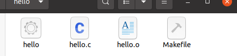

## PA0: Linux开发环境配置

Date:	2022/01/19

### 一. Linux系统安装

> 本次实验中使用`wsl2`

**实验过程**：

  1. 在`powershell`中键入`wsl --install` 指令
  2. 安装`ubuntu 20.04`
  3. 将系统升级至`21.10`


### 二. Ubuntu系统配置

**配置过程**：

1. 账户配置
2. 更换科大源
3. 安装必要的工具


### 三. 学习使用vim

* 通过`vimtutor`指令从官方教程学习
* 配置`vim`高亮


### 四. 执行`Hello world`代码

* 生成结果如下图所示：

   

* 学习`Makefile`，参考[教程](https://www.ruanyifeng.com/blog/2015/02/make.html)

```makefile
hello: hello.o
	gcc -o hello hello.o
	./hello
	
hello.o: hello.c
	gcc -c hello.c

clean:
	rm -rf hello hello.o
```

 

### 五. 使用`git`管理pa

* 先对`git`进行基本配置

* 使用`git`修改学号与姓名

  

  

* 提交修改

  

* 完成提交


### 六. 读后感

* 见 [我的感想](doc.md)


